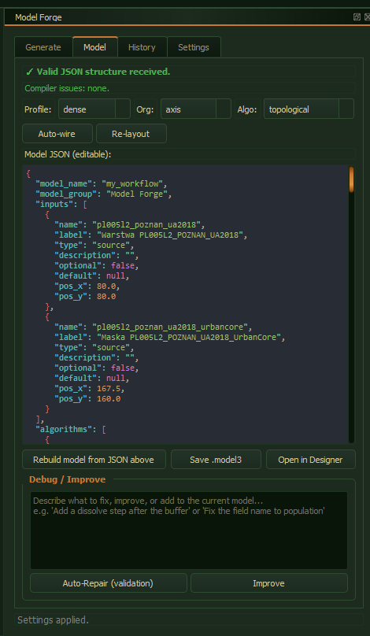
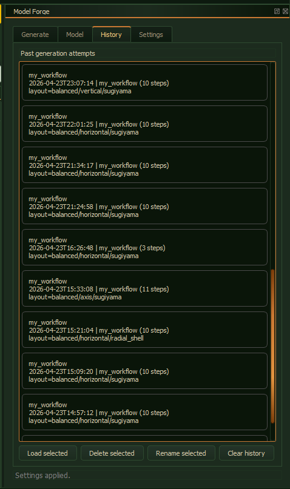
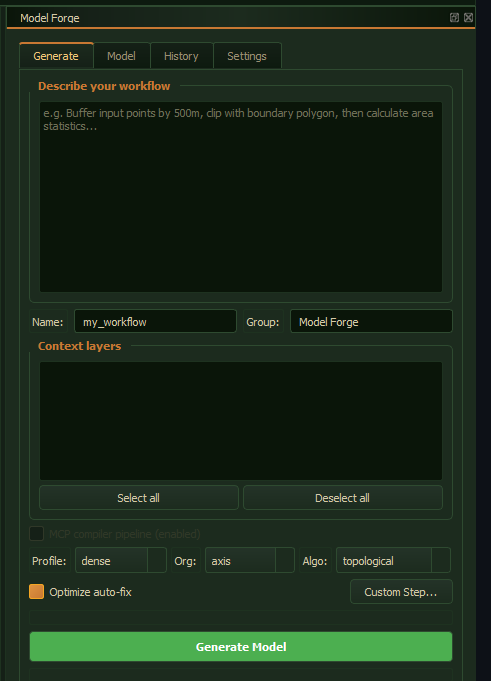
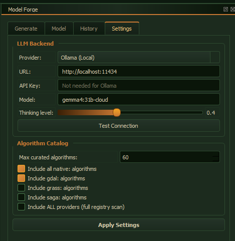
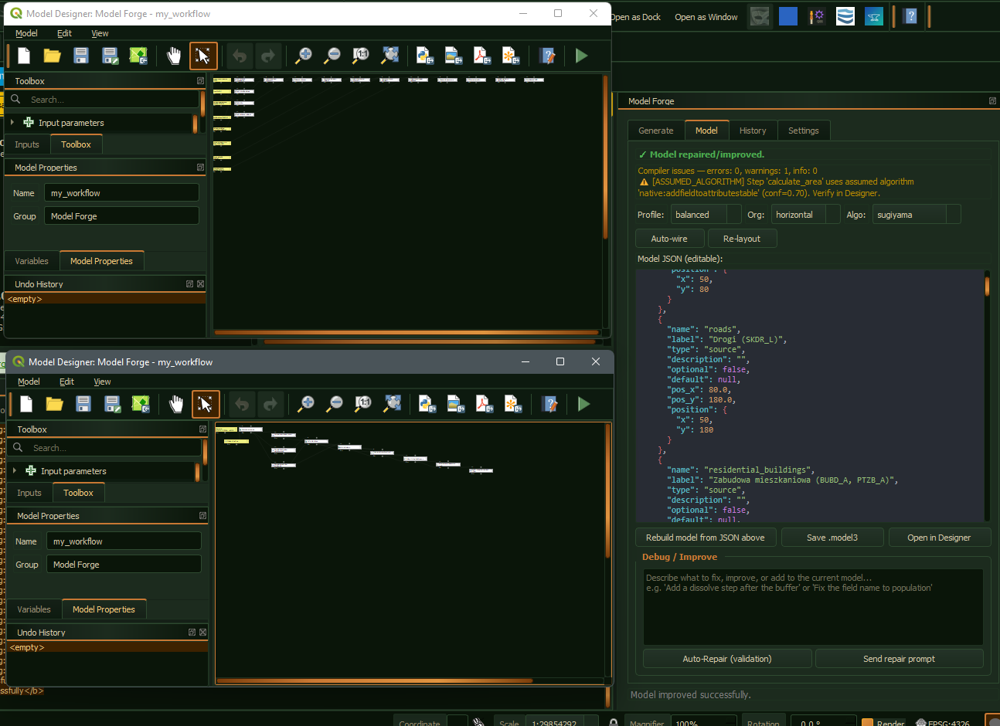

[](https://github.com/Wolren/ModelForge/actions/workflows/ci.yml)
[](LICENSE)
[](https://securityscorecards.dev/viewer/?uri=github.com/Wolren/ModelForge)
[](https://socket.dev)
[](https://www.python.org/downloads/)
[](https://qgis.org)
[](https://www.qt.io/)

# Model Forge 

> **EXPERIMENTAL** - This plugin is a work in progress. APIs, features, and UI may change without notice. External links and documentation may become outdated or broken.

## What is Model Forge?

Model Forge is a QGIS plugin that generates editable geoprocessing models from plain-language descriptions. It bridges AI language models with QGIS Processing Framework, transforming natural language workflow descriptions into visual models ready for editing, refinement, and execution.

### Gallery


| Generate Tab                              | Model Tab                           | Settings Tab                              | History Tab                             |
| ----------------------------------------- | ----------------------------------- | ----------------------------------------- | --------------------------------------- |
|  |  |  |  |


| Generated Result              |
| ----------------------------- |
|  |

### Architecture

```
User Description --> LLM Backend --> QGIS Processing Model
(e.g. "Buffer    (OpenAI,         (.model3 file,
 then clip...")  Ollama, any     editable in Designer)
                  OpenAI-compatible)
```

### Key Capabilities

- **Natural language to model** - Describe workflows like "Buffer input points by 500m, clip with city boundary, compute mean population"
- **Multi-LLM support** - Works with OpenAI, Azure OpenAI, Anthropic, Google Gemini, Ollama, and any OpenAI-compatible endpoint (LM Studio, vLLM, OpenRouter, llama.cpp, local models, custom endpoints). Not locked to a single provider unlike [IntelliGeo](https://github.com/MahdiFarnaghi/intelli_geo)
- **Visual model generation** - Opens directly in QGIS Model Designer with pre-computed layouts
- **Iterative refinement** - Use repair prompts to fix or extend generated models
- **Layout algorithms** - Sugiyama, topological, axis pack, radial shell, ancestor weighted

---

## Known Issues

- External links may become outdated or broken
- Experimental features may change without notice
- Generated model quality depends on LLM capability
- Custom step registration does not persist across sessions

---

## User Guide

### Installation

1. Install via QGIS Plugin Manager (Plugins -> Manage and Install Plugins -> search "Model Forge")
2. Open panel: Plugins -> Model Forge -> Open Model Forge
3. Configure LLM backend in Settings tab

### Generate a Model

1. Go to **Generate** tab
2. Enter workflow description:
   > *"Buffer input points by 500 m, clip with the city boundary, then compute mean population per buffer."*
   >
3. Optional: set Name/Group, select Context layers, choose Layout profile/organisation/algorithm
4. Click **Generate Model**
5. View result in **Model** tab

### Model Tab Functions


| Action                    | Purpose                                              |
| ------------------------- | ---------------------------------------------------- |
| Model JSON (editable)     | View/edit workflow JSON                              |
| Rebuild model from JSON   | Apply manual edits to QGIS model                     |
| Save .model3              | Export to file loadable in Processing Model Designer |
| Open in Designer          | Launch Model Designer with pre-computed layout       |
| Auto-wire model steps     | Auto-connect missing parameter connections           |
| Re-layout current JSON    | Re-apply layout without regeneration                 |
| Auto-layout (Model Forge) | In-Designer re-layout                                |

### History

- **History** tab stores recent generation attempts
- Load, rename, delete, or clear past entries
- Restores saved model JSON and layout controls

### Repair Mode

- **Auto-Repair** - validates JSON structure and sends repair request to LLM if issues found
- **Send repair prompt** - describe fixes (e.g., "add dissolve after clip", "rename field to pop_2020")

### Settings

- Provider selection (OpenAI, Ollama, custom)
- API URL, key, temperature
- Algorithm catalog configuration

---

## Developer Notes

### Repository Structure

```
Model Forge/
├── model_forge/                    # Canonical stitched plugin
│   ├── model_forge.py             # Plugin entry point
│   ├── forge_dock.py              # Dock widget wrapper
│   ├── forge_widget.py            # Main UI (Generate/Model/Settings)
│   ├── forge_generate_worker.py   # Background generation thread
│   ├── legacy_base/               # Original LLM->JSON workflow
│   └── compiler_core/             # MCP compiler pipeline
├── model_forge_initial/           # Legacy variant (deprecated)
└── modelforge_arch/               # Architecture variant (deprecated)
```

### Key Modules


| Module                 | Purpose                              |
| ---------------------- | ------------------------------------ |
| `model_forge.py`       | Plugin registration, toolbar, menu   |
| `forge_dock.py`        | Embeds ForgeWidget into QGIS dock    |
| `forge_widget.py`      | UI logic, tab management, LLM wiring |
| `llm_backend.py`       | LLM abstraction layer                |
| `context_collector.py` | Gathers project/algorithm context    |
| `model_builder.py`     | JSON -> QingProcessingModelAlgorithm |
| `model_layout.py`      | DAG layout computation               |

### Concurrency

- LLM calls run in background QThread
- GenerateWorker emits finished(dict) or error(str)
- RepairWorker follows identical pattern

### Persistence

- QSettings with prefix `ModelForge/`
- Stores: backend config, URL, API key, temperature, algorithm catalog

### Model JSON Schema

```json
{
  "inputs": [{ "id": "input_points", "type": "vector", "geometry": "point" }],
  "algorithms": [
    {
      "id": "buffer_step",
      "algorithm_id": "native:buffer",
      "parameters": {
        "INPUT": { "type": "child_output", "child_id": "input_points" },
        "DISTANCE": 500
      }
    }
  ]
}
```

Child outputs use `{ "type": "child_output", "child_id": "step_id" }`. Validation performed by `_validate_model()` in forge_widget.py.

---

## MCP Server

Model Forge ships an [MCP (Model Context Protocol)](https://modelcontextprotocol.io) server so any MCP-compatible client (Claude Desktop, Cursor, Cline, Continue, etc.) can drive the QGIS model generation pipeline directly.

### Install

```bash
pip install model-forge[mcp]
```

That's the same package; the `mcp` extra adds the `mcp` and `uvicorn` dependencies. The `model-forge` console script is installed automatically.

### Quick start (Claude Desktop)

Edit `claude_desktop_config.json` and add:

```json
{
  "mcpServers": {
    "model-forge": {
      "command": "model-forge",
      "args": ["--transport", "stdio"]
    }
  }
}
```

For the SSE transport (e.g. a remote / browser client):

```bash
model-forge --transport sse --host 127.0.0.1 --port 9090
# MCP endpoint: http://127.0.0.1:9090/sse
```

### Configuring the LLM

Before calling `generate_model`, the server needs an LLM backend. Either configure it via the `set_llm_config` tool, or pass CLI flags / env vars at startup:

```bash
# Ollama (default)
model-forge --llm-provider ollama --llm-model qwen2.5-coder:7b

# OpenAI
model-forge --llm-provider openai --llm-api-key sk-... --llm-model gpt-4o-mini

# Any OpenAI-compatible endpoint (LM Studio, vLLM, OpenRouter, ...)
model-forge --llm-provider openai_compat \
  --llm-base-url http://localhost:1234 \
  --llm-model local-model \
  --llm-api-key not-needed

# Anthropic
model-forge --llm-provider anthropic --llm-api-key sk-ant-... --llm-model claude-3-5-sonnet-latest

# Azure OpenAI (model = deployment name; base_url = resource endpoint)
model-forge --llm-provider azure_openai \
  --llm-model my-gpt4-deployment \
  --llm-base-url https://<resource>.openai.azure.com \
  --llm-api-key <azure-key>

# Google Gemini
model-forge --llm-provider gemini --llm-api-key AIza... --llm-model gemini-1.5-pro

# Persist so subsequent boots reuse it
model-forge --llm-provider ollama --llm-model qwen2.5-coder:7b
# the server writes to $MODELFORGE_MCP_CONFIG (default ~/.config/model-forge/mcp.json)
```

Equivalent env vars (lowest priority): `MODELFORGE_PROVIDER`, `MODELFORGE_MODEL`, `MODELFORGE_BASE_URL`, `MODELFORGE_API_KEY`, `MODELFORGE_TEMPERATURE`, `MODELFORGE_TIMEOUT`, `MODELFORGE_DEFAULT_HEADERS` (JSON object), `MODELFORGE_EXTRA_BODY` (JSON object). `MODELFORGE_REQUIRE_KEY=0` skips the API key check for self-hosted deployments.

### Tool catalog (28 tools)

| Category | Tool | Purpose |
| --- | --- | --- |
| Context | `list_layers`, `get_layer_info`, `get_project_info`, `refresh_qgis_context`, `configure_headless_context` | QGIS project state, plus headless context override |
| Algorithms | `list_algorithms`, `get_algorithm_info`, `list_providers`, `list_algorithm_groups`, `load_catalog_from_file`, `export_catalog` | Algorithm discovery + headless catalog I/O |
| Generation | `generate_model`, `validate_model`, `export_model`, `summarize_model` | The main pipeline + validation + 8 export formats (`json` / `mermaid` / `script` / `model3` / `geojson` / `gpkg` / `runnable_script` / `processing_runnable_json`) |
| Map building | `generate_print_layout`, `verify_layout`, `export_layout`, `generate_symbology`, `execute_model` | Auto-build a print layout (.qpt), per-layer QML symbology, run a model in headless QGIS, render to PDF/PNG/SVG |
| Management | `set_llm_config`, `get_server_info`, `ping`, `cancel_generation`, `get_generation_status`, `subscription_status`, `subscribe_resource`, `unsubscribe_resource` | Server control, job lifecycle, resource subscription |

Plus 6 outer prompts: `generate_model_from_intent`, `explain_model`, `convert_script_to_model`, `generate_complete_map_from_intent`, `generate_print_layout_from_model`, `generate_symbology_from_model`.

### Map building: layout, symbology, execution

The `generate_*` and `execute_model` tools close the model->map loop. The flow is:

1. **`generate_model`** - produce the model JSON (the same as the other tools).
2. **`generate_symbology`** - emit one `.qml` file per output layer. The LLM picks the renderer (`single_symbol` / `categorized` / `graduated` / `rule_based`); the builder applies sensible defaults per geometry type.
3. **`generate_print_layout`** - emit a `.qpt` print layout template. Templates: `default` (A4 portrait, full-bleed), `scientific` (Letter portrait, metadata block), `presentation` (16:9 landscape), `minimal` (legend-less, scale-bar only).
4. **`verify_layout`** - run the ruleset against the .qpt (title within margins, scale bar >= 15mm, legend within map footprint, metadata block in scientific, no critical overlaps). Returns a list of stable violation codes (`E_TITLE_OUT_OF_MARGINS`, `E_LEGEND_OUTSIDE_MAP`, `E_NO_METADATA`, etc.) the LLM uses as constraints in a re-try loop (max 2 retries).
5. **`export_layout`** - render the .qpt to PDF / PNG / SVG via `QgsLayoutExporter` (QGIS-required).
6. **`execute_model`** - run a model JSON in headless QGIS via `processing.run()`. Topological execution with retries, per-step timing, and cancellation. Pure-Python on top of QGIS's `processing` module; no GUI needed.

The chained prompt `generate_complete_map_from_intent` orchestrates the whole flow: `generate_model` -> `generate_symbology` -> `generate_print_layout` -> `verify_layout` (re-try on violations) -> `export_layout`. This is the v3 "one-shot demo" - describe a workflow, get a model + a printable PDF.

### Resources (3)

| URI | Content |
| --- | --- |
| `model-forge://server-info` | Version, schema version, supported providers, tool list, prompt list, subscription capabilities |
| `model-forge://context/layers` | Current project layers (or headless snapshot) |
| `model-forge://algorithms` | Algorithm index: `[{id, name, group}]` |

Resources can be subscribed to; the server pushes dirty-set updates that the client polls via `subscription_status(consume=True)`.

### Streaming progress + cancellation

`generate_model` accepts `progress_token: str` and `timeout_seconds: float`. When a token is supplied, the server forwards structured `(current, total, message)` notifications via the MCP `notifications/progress` channel. Long-running jobs get a `job_id` back in the response; pair it with `cancel_generation(job_id)` for mid-flight cancellation, or `get_generation_status(job_id)` to inspect progress.

### Error model

Every tool returns either a JSON payload (the model) or a structured error:

```json
{
  "code": "E_LLM_NOT_CONFIGURED",
  "message": "LLM not configured. Set provider/model via set_llm_config tool.",
  "details": { "provider": "" }
}
```

Stable codes include `E_LLM_NOT_CONFIGURED`, `E_INVALID_JSON`, `E_ALG_NOT_FOUND`, `E_LAYER_NOT_FOUND`, `E_VALIDATION_FAILED`, `E_PIPELINE_FAILED`, `E_QGIS_NOT_AVAILABLE`, `E_LLM_PROVIDER`, `E_CANCELLED`, `E_TIMEOUT`, `E_UNKNOWN_FORMAT`, `E_CONFIG`, `E_INTERNAL`. The schema version is reported in `model-forge://server-info`.

### Pure-Python / headless mode

The server boots cleanly without QGIS installed. In that mode, `qgis_available` is `false` and the context tools return empty results. To work headlessly:

1. Call `export_catalog(path)` from a QGIS-equipped dev machine to dump the live catalog.
2. On the headless box, call `load_catalog_from_file(path)`.
3. Call `configure_headless_context(layers_json=...)` with a layer snapshot to give `list_layers` something to report.

Algorithm discovery (`list_algorithms`, `get_algorithm_info`, `list_providers`, `list_algorithm_groups`) works against the loaded catalog. `generate_model` runs end-to-end - the compiler pipeline tolerates the missing QGIS registry via try/except fallbacks.

### Security

The SSE transport binds to `127.0.0.1` by default (loopback only). For non-localhost deployments:

```bash
model-forge --transport sse --host 0.0.0.0 --port 9090 \
  --auth-token "$MODELFORGE_TOKEN" \
  --tls-cert /etc/ssl/model-forge.crt \
  --tls-key /etc/ssl/model-forge.key
```

The `--auth-token` (or `MODELFORGE_MCP_TOKEN` env var) requires `Authorization: Bearer *** (or `X-Model-Forge-Token: <token>`) on every request; `/healthz` is exempt. TLS via `--tls-cert` / `--tls-key` serves HTTPS on the same SSE endpoint. The shutdown timeout (`--shutdown-timeout`, default 15s) controls how long `stop_server` waits for in-flight SSE messages to drain.

### Embedding in QGIS

The QGIS plugin (loaded via Plugin Manager) starts and stops the same MCP server in a background thread. Tool users can attach an external MCP client to the same in-process server via `--transport sse` from a separate `model-forge` invocation, or rely on the in-process stdio connection the plugin uses internally.

---

## Support

- Report issues: https://github.com/Wolren/ModelForge/issues
- Verify all external links before relying on them

---

*Last updated: 05.2026*
