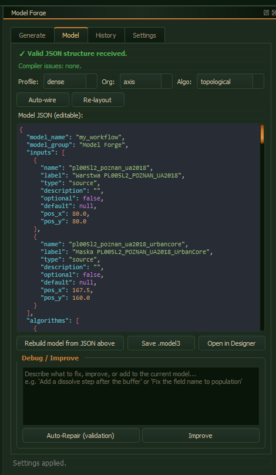
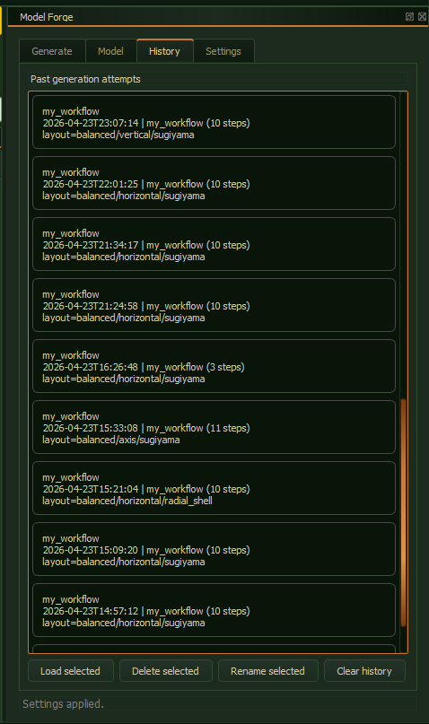
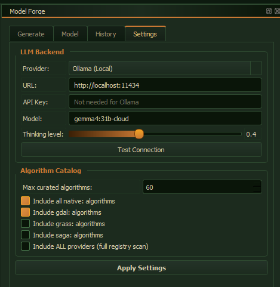
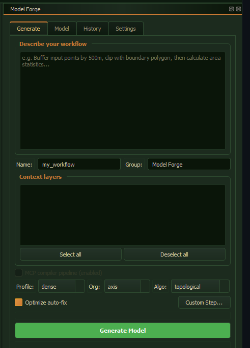
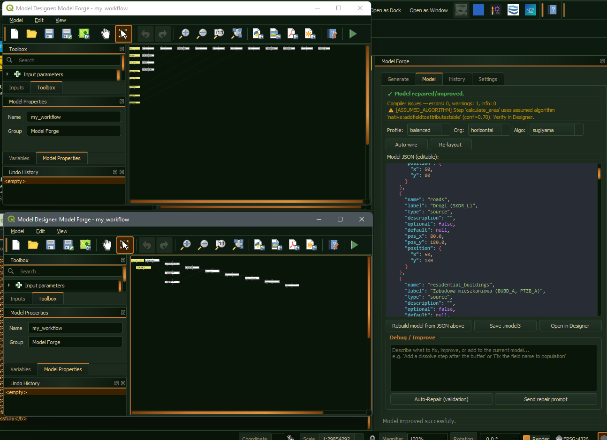
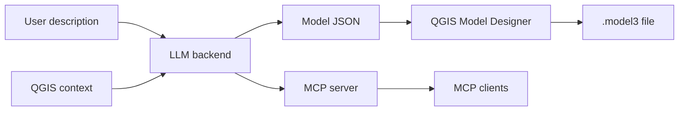

<div align="center">


# Model Forge

Generate editable geoprocessing models from plain-language descriptions. Connects language models to the QGIS Processing Framework.

[![License][license-badge]][license-url]
[![Last commit][commit-badge]][commits-url]
[![Issues][issues-badge]][issues-url]
[![Code size][size-badge]][repo-url]
[![Python][python-badge]][pyproject-url]
[![QGIS][qgis-badge]][qgis-url]
[![CI][ci-badge]][ci-url]
[![Status][status-badge]][repo-url]

</div>

> **This plugin is experimental.** APIs, features, and UI may change without notice. External links and documentation may become outdated or broken.

## What is Model Forge?

A QGIS plugin that turns natural-language workflow descriptions into editable Processing models. It connects language models to the QGIS Processing Framework: describe a workflow in plain English, get a visual model you can edit, refine, and run.

## Gallery

| Generate Tab | Model Tab | History Tab | Settings Tab |
|---|---|---|---|
|  |  |  |  |

| Generated Result |
|---|
|  |

## Key capabilities

- **Natural language to model** - e.g. "Buffer input points by 500m, clip with city boundary, compute mean population"
- **Multi-LLM** - OpenAI, Azure OpenAI, Anthropic, Google Gemini, Ollama, and any OpenAI-compatible endpoint
- **Visual generation** - opens in QGIS Model Designer with pre-computed layouts
- **Iterative refinement** - repair prompts to fix or extend generated models
- **Layout algorithms** - Sugiyama, topological, axis pack, radial shell, ancestor weighted
- **MCP server** - drive the same pipeline from any MCP client

## Architecture


```mermaid
graph LR
    A["User description"] --> B["LLM backend"]
    C["QGIS context"] --> B
    B --> D["Model JSON"]
    D --> E["QGIS Model Designer"]
    E --> F[".model3 file"]
    B --> G["MCP server"]
    G --> H["MCP clients"]
```

## Compatibility

| QGIS version | Qt | Python | Status |
|---|---|---|---|
| 3.22 LTR | Qt5 | 3.10+ | Tested in CI |
| 3.x stable | Qt5/Qt6 | 3.10+ | Tested in CI |
| 4.2 | Qt6 | 3.10+ | Tested in CI |
| 4.x latest | Qt6 | 3.10+ | Tested in CI |

## Installation

1. Install via QGIS Plugin Manager (Plugins -> Manage and Install Plugins -> search "Model Forge")
2. Open panel: Plugins -> Model Forge -> Open Model Forge
3. Configure LLM backend in the Settings tab

## Usage

1. Go to the **Generate** tab
2. Enter a workflow description, e.g. *"Buffer input points by 500 m, clip with the city boundary, then compute mean population per buffer."*
3. Optionally set Name/Group, Context layers, and a layout profile/organisation/algorithm
4. Click **Generate Model**
5. View and edit the result in the **Model** tab: edit the JSON, rebuild the model, save `.model3`, open in the Model Designer, auto-wire missing connections, or re-layout

The **History** tab stores recent generations (load, rename, delete, clear). **Repair mode** validates the JSON and sends repair requests to the LLM (auto-repair, or custom prompts like "add dissolve after clip").

## MCP server

> **Experimental** - the MCP surface is actively evolving. Tool names, parameters, and error codes may change between releases.

Model Forge ships an [MCP (Model Context Protocol)](https://modelcontextprotocol.io) server (MCP SDK 2.x) so any MCP-compatible client (Claude Desktop, Cursor, Cline, Continue) can drive the model generation pipeline directly. See [docs/MCP.md](docs/MCP.md) for the full reference.

### Install

```bash
pip install model-forge      # mcp SDK 2.x is a base dependency
pip install uvicorn          # only needed for SSE transport
```

### Quick start (Claude Desktop)

```json
{
  "mcpServers": {
    "model-forge": {
      "command": "python",
      "args": ["-m", "model_forge.mcp_server", "--transport", "stdio"]
    }
  }
}
```

SSE transport: `python -m model_forge.mcp_server --transport sse --host 127.0.0.1 --port 9090` (endpoint `http://127.0.0.1:9090/sse`).

### Configure the LLM

Pass CLI flags at startup, or call the `set_llm_config` tool:

```bash
python -m model_forge.mcp_server --llm-provider ollama --llm-model qwen2.5-coder:7b
```

Providers: `ollama` (default), `openai`, `openai_compat`, `azure_openai`, `anthropic`, `gemini`. Equivalent env vars (lowest priority): `MODELFORGE_PROVIDER`, `MODELFORGE_MODEL`, `MODELFORGE_BASE_URL`, `MODELFORGE_API_KEY`, `MODELFORGE_TEMPERATURE`, `MODELFORGE_TIMEOUT`, `MODELFORGE_DEFAULT_HEADERS`, `MODELFORGE_EXTRA_BODY`. `MODELFORGE_REQUIRE_KEY=0` skips the API key check for self-hosted deployments. Config persists to `$MODELFORGE_MCP_CONFIG` (default `~/.config/model-forge/mcp.json`).

### Tool catalog (23 tools)

| Category | Tools | Purpose |
| --- | --- | --- |
| Context | `list_layers`, `get_layer_info`, `get_project_info`, `refresh_qgis_context`, `configure_headless_context` | QGIS project state + headless context override |
| Algorithms | `list_algorithms`, `get_algorithm_info`, `list_providers`, `list_algorithm_groups`, `load_catalog_from_file`, `export_catalog` | Algorithm discovery + headless catalog I/O |
| Generation | `generate_model`, `validate_model`, `export_model`, `summarize_model` | Pipeline + validation + 8 export formats (`json`, `mermaid`, `script`, `model3`, `geojson`, `gpkg`, `runnable_script`, `processing_runnable_json`) |
| Management | `set_llm_config`, `get_server_info`, `ping`, `cancel_generation`, `get_generation_status`, `subscription_status`, `subscribe_resource`, `unsubscribe_resource` | Server control, job lifecycle, subscriptions |

Plus 3 outer prompts: `generate_model_from_intent`, `explain_model`, `convert_script_to_model`.

### Resources (3)

| URI | Content |
| --- | --- |
| `model-forge://server-info` | Version, schema version, providers, tool list, prompts, subscription capabilities |
| `model-forge://context/layers` | Current project layers (or headless snapshot) |
| `model-forge://algorithms` | Algorithm index: `[{id, name, group}]` |

Resources are subscribable; the server tracks a dirty set that clients poll via `subscription_status(consume=True)`.

## Tech stack

| Tool | Purpose |
|---|---|
| Python 3.10+ | Plugin runtime |
| QGIS 3.22+ | Host application and Processing Framework |
| Qt 5.x / 6.x | UI framework |
| MCP SDK 2.x | MCP server transport (SSE requires uvicorn) |
| OpenAI-compatible clients | LLM backends |

## Limitations

- External links may become outdated or broken.
- Experimental features may change without notice.
- Generated model quality depends on LLM capability.
- Custom step registration does not persist across sessions.
- Headless mode runs without QGIS, but QGIS-dependent tools (model3 export, layout export, model execution) report `E_QGIS_NOT_AVAILABLE` until a QGIS-equipped machine is used.

## Support

- Report issues: https://github.com/Wolren/ModelForge/issues
- Verify all external links before relying on them

## Contributing

See [CONTRIBUTING.md](CONTRIBUTING.md).

## Security

See [SECURITY.md](SECURITY.md).

## License

GNU General Public License v3.0 - see [LICENSE](LICENSE).

[license-badge]: https://img.shields.io/github/license/Wolren/ModelForge
[license-url]: LICENSE
[commit-badge]: https://img.shields.io/github/last-commit/Wolren/ModelForge
[commits-url]: https://github.com/Wolren/ModelForge/commits
[issues-badge]: https://img.shields.io/github/issues/Wolren/ModelForge
[issues-url]: https://github.com/Wolren/ModelForge/issues
[size-badge]: https://img.shields.io/github/languages/code-size/Wolren/ModelForge
[repo-url]: https://github.com/Wolren/ModelForge
[python-badge]: https://img.shields.io/badge/Python-3.10+-blue?logo=python
[pyproject-url]: pyproject.toml
[qgis-badge]: https://img.shields.io/badge/QGIS-3.22+-green
[qgis-url]: https://qgis.org
[ci-badge]: https://github.com/Wolren/ModelForge/actions/workflows/ci.yml/badge.svg
[ci-url]: https://github.com/Wolren/ModelForge/actions/workflows/ci.yml
[status-badge]: https://img.shields.io/badge/status-experimental-orange.svg
